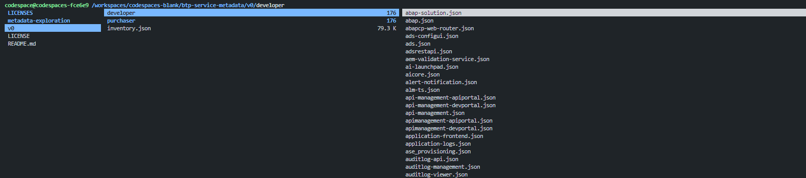
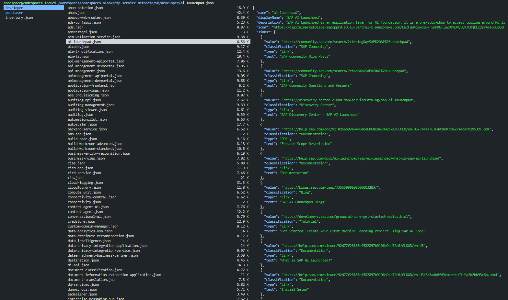
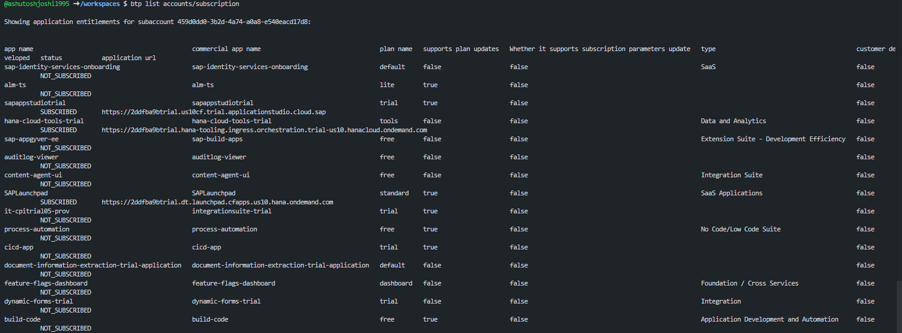
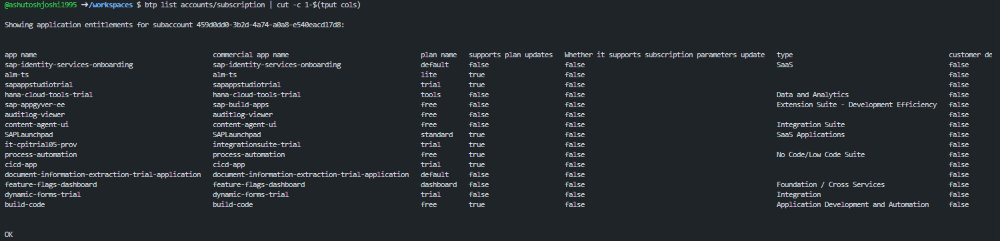

# sap-bash-play

This repo will be a guide to various linux commands which can be helpful to use the bash terminal in VSCode, BAS or any Linux env.

## Using Terminal

1. Binding shortcut to clear the terminal. Below command binds Ctrl + l to the clear command

    ````bash
    bind -x '"\C-l": clear'   
    ````

2. Setting command aliases for shorter commands

    The below code sets only the alias temporary. It needs to be set in ~/bash.rc file.

    ````bash
    alias r='ranger'
    ````

    We can use the ls command with -a OPTION to see the hidden files in Home (~) directory. (FunFact: Home and ~ is used to refer the same because it was the same key in Mainframe keyboard).

    ```bash
    ls -al ~/
    ```

    It would show all the files: 

    ```bash
    total 208
    drwxrwsr-x 1 codespace codespace  4096 Jan  3 09:18 .
    drwxr-xr-x 1 root      root       4096 Dec 31 15:38 ..
    -rw-r--r-- 1 codespace codespace    17 Jan  3 09:18 .bash_aliases
    -rw------- 1 codespace codespace 22186 Jan  7 05:37 .bash_history
    -rw-rw-r-- 1 codespace codespace   220 Feb 25  2020 .bash_logout
    -rw-rw-r-- 1 codespace codespace  6086 Jan  2 13:11 .bashrc
    ... and so on
    ```

    Edit the file or create the file .bash_aliases which is referred in the .bashrc file. (modularisation)
    Use Vim or Nano or Code to do this.

    ```bash
    cd ~/
    code .bash_aliases
    ```

    And add the line `alias r='ranger'` to the file to make this alias permanent.

3. Using ranger for terminal based file explorer: 

    Use the `ranger` command to start the terminal based file browser which provides a splitscreen preview and easily navigate the directories. It provides immediate preview of the file in the splitscreen pane. We can use `Shift + S` to open the terminal in the current directory and open the ranger back using `Ctrl + D`.

    It can be installed using `apt-get` in Linux env.

    

    

4. Cut long text to arrange the columns properly

    We can use the `tput` command along with `cut` to cut the long running text upto the screen / terminal width.

    ```bash
    btp list accounts/subscription | cut -c 1-$(tput cols)
    ```
    The below image shows text overflowing to the next lines:

    

    It can be formatted easily using the command to show it aligned:

    

5. 

## Curl

## Jq

## BTP

1. Enable Autocomplete in BTP - useful for performing any operation by pressing TAB.

````bash
btp enable autocomplete bash
````

## Cloud Foundry

## CDS (Node.js)

## Node.js

1. List all installed packages globally:

```bash
npm ls -g
npm list --global
```

It would show all the installed packages in tree form.

```bash
/usr/local/share/nvm/versions/node/v20.18.1/lib
├── @sap/cds-dk@8.6.1
├── @sap/generator-base-mta-module@2.0.0
├── @sap/generator-cap-project@1.8.2
├── @sap/generator-fiori@1.16.1
├── @sap/generator-hdb-project@1.14.0
├── @sap/ux-ui5-tooling@1.16.0
├── corepack@0.29.4
├── generate-gitignore@0.2.6
├── generate@0.14.0
├── npm@10.8.2
└── pnpm@9.15.0
```
